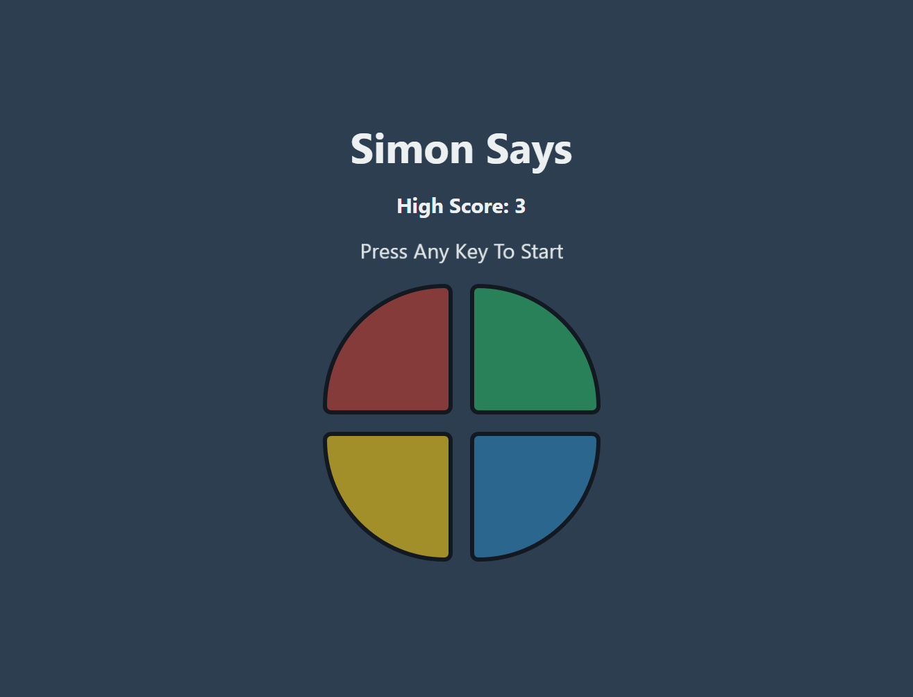

# Simon Says Game 🧠

A classic memory game of Simon Says built with vanilla JavaScript, HTML, and CSS. This project was created as a way to practice and demonstrate core JavaScript concepts, including DOM manipulation, event handling, and managing game state.



## ✨ Live Demo

**Play the game here:** [https://Ryker009.github.io/Simon-Say-Game/](https://Ryker009.github.io/Simon-Say-Game/)

---

## 🚀 Features

* **Classic Simon Says Gameplay:** Follow the sequence of lights and sounds for as long as you can.
* **Increasing Difficulty:** The pattern gets longer and the game speeds up as your level increases.
* **Visual & Audio Feedback:** Buttons flash and unique sounds play for each color, providing a rich user experience.
* **Background Music:** Soothing background music plays during idle times to create a pleasant atmosphere.
* **Game Over Effects:** Clear audio and visual cues when the game ends.
* **Persistent High Score:** Your highest score is saved in your browser's local storage, so you can challenge yourself to beat it in the future!
* **Responsive Design:** The game is playable on both desktop and mobile devices.

---

## 🛠️ Tech Stack

* **HTML5:** For the structure of the game.
* **CSS3:** For styling, animations, and the responsive grid layout.
* **JavaScript (ES6):** For all the game logic, including sequence generation, user input handling, and audio controls.
* **Web Storage API:** Used `localStorage` to persist the high score across browser sessions.

---

## 🏁 Getting Started

To run this project on your local machine, follow these simple steps:

1.  **Clone the repository:**
    ```bash
    git clone [https://github.com/Ryker009/Simon-Say-Game.git](https://github.com/Ryker009/Simon-Say-Game.git)
    ```
2.  **Navigate to the project directory:**
    ```bash
    cd Simon-Say-Game
    ```
3.  **Open the `index.html` file in your browser:**
    * Simply double-click the `index.html` file, or right-click and choose "Open with" your favorite browser.

And that's it! The game is now running locally.

---

## 📄 License

This project is licensed under the MIT License. See the `LICENSE` file for details.